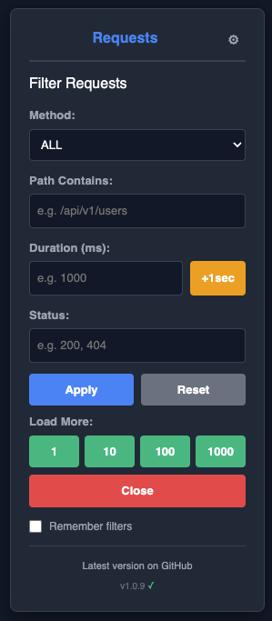

# Laravel Telescope Filter Bookmarklet

A powerful browser bookmarklet that adds advanced filtering capabilities to [Laravel Telescope](https://laravel.com/docs/telescope). Filter requests, HTTP client calls, and jobs with ease, featuring smart auto-switching tabs, duration filters, and bulk loading.


> **⚠️ Warning**: This project was created through AI-assisted rapid development (vibecoding). While functional, it may not have been thoroughly tested in all environments. Use at your own discretion.

## 🔗 Related Projects

- **[Laravel](https://laravel.com/)** - The PHP framework for web artisans
- **[Laravel Telescope](https://laravel.com/docs/telescope)** - An elegant debug assistant for Laravel applications

## 📸 Screenshot



*Advanced filtering panel with Telescope Links settings for quick access to your Telescope instances*

## 📦 Installation

### Quick Install (Recommended)

**Get the bookmarklet code:**

🔗 **[Click here to view and copy the bookmarklet code](https://github.com/Antons-S/laravel-telescope-filter/blob/main/dist/bookmarklet.txt)**

**Create the bookmark:**
1. Click the link above and copy the entire bookmarklet code
2. Create a new bookmark in your browser:
   - **Chrome/Edge**: Right-click bookmarks bar → "Add page"
   - **Firefox**: Right-click bookmarks toolbar → "New bookmark"
   - **Safari**: Bookmarks → Add Bookmark
3. Set these values:
   - **Name**: `Telescope Filter` (or any name you prefer)
   - **URL**: Paste the copied bookmarklet code
4. **Done!** Visit any Laravel Telescope page and click the bookmark

### Option 2: Build from Source (For Development)

If you want to modify the code or contribute:

```bash
# Clone the repository
git clone https://github.com/Antons-S/laravel-telescope-filter.git
cd laravel-telescope-filter

# Install dependencies
npm install

# Build the bookmarklet
npm run build

# The output will be in dist/bookmarklet.txt
```

## 🚀 Usage

### Quick Access to Telescope (New!)

**Setup (one-time per site):**

1. Navigate to any page on your site (e.g., `example.com/uk/users/account/`)
2. Click the bookmarklet
3. Settings modal will open automatically
4. The left column will be pre-filled with your current URL
5. Adjust the site URL pattern (e.g., remove `/users/account/` → `example.com/uk/`)
6. Enter your Telescope URL in the right column (e.g., `https://example.com/uk/telescope`)
7. Click **Save**

**Usage:**

- Click the bookmarklet anywhere on that site → Telescope opens in a new tab!
- Works across different paths on the same domain (e.g., `/uk/`, `/at/`, `/de/`)
- Each domain stores its own telescope links

### Basic Filtering

1. Navigate to your Laravel Telescope page (e.g., `/telescope/requests`)
2. Click the bookmarklet from your bookmarks bar
3. The filter panel will appear in the top-right corner
4. Set your desired filters
5. Click **Apply** to activate filtering
6. Click the **⚙ (cog icon)** to access settings

### Filter Examples

#### Find Slow Requests
1. Go to Requests tab
2. Enter `1000` in Duration field (or click +1sec button)
3. Click Apply
4. All requests taking less than 1 second will be hidden

#### Find Failed HTTP Calls
1. Go to HTTP tab
2. Enter `5` in Status field (matches 500, 502, 503, etc.)
3. Click Apply

#### Find Specific Jobs
1. Go to Jobs tab
2. Enter job class name (e.g., `SendEmail`)
3. Enter status (e.g., `failed`)
4. Click Apply

#### Load More Entries
- Click the **Load More** button to automatically load 100 batches of older entries
- The button will disable auto-load to prevent conflicts
- Watch the console for progress updates

### Keyboard Shortcuts

- **Enter** in any input field: Apply filters
- **ESC**: Not implemented (use Close button)

## ✨ Features

### Telescope Quick Access
- **Auto-open Telescope** - Configure site-to-telescope URL mappings
- **One-click access** - Click bookmarklet on any page to open Telescope in a new tab
- **Smart settings** - Pre-fills current URL when adding new mappings
- **Domain-specific storage** - Each domain maintains its own list of telescope links in localStorage
- **Example**: Map `example.com/uk/` to `https://example.com/uk/telescope` - click the bookmarklet anywhere on the UK site to instantly open UK Telescope

### Smart Page Detection
- **Auto-detection** - Automatically detects which Telescope page you're viewing
- **13 supported pages** - Requests, HTTP Client, Jobs, Commands, Cache, Queries, Events, Gates, Logs, Models, Redis, Views, and Exceptions
- **Page-specific filters** - Each page shows only relevant filters for that data type

### Advanced Filtering
- **HTTP method filtering** - Filter by method (GET, POST, PUT, PATCH, DELETE) on Requests & HTTP Client pages
- **Status code filtering** - Filter by response status codes with partial matching
- **Duration filtering** - Set minimum duration threshold in milliseconds
  - **+1sec quick button** - Increment duration by 1000ms with a single click
- **Text search filtering** - Search by path, URI, query, command name, message, and more
- **Specialized filters** - Exit codes, cache actions, log levels, model actions, exception types, and more

### Smart Auto-Refresh
- **Continuous filtering** - Filters apply automatically to newly loaded entries every 500ms
- **No re-apply needed** - Once filters are applied, they work on dynamic content

### Bulk Loading
- **Load More button** - Automatically clicks "Load Older Entries" 100 times
- **Smart conflict prevention** - Automatically disables Telescope's auto-load to prevent conflicts
- **Configurable delay** - 300ms delay between each click for stability

### User Experience
- **Dark theme** - Matches Telescope's UI perfectly
- **Enter key support** - Press Enter any input field to apply filters
- **Reset button** - Clear all filters and stop auto-refresh with one click
- **Minimal UI** - Fixed position panel that doesn't interfere with Telescope
- **Version checking** - Automatically checks for updates and notifies you when a new version is available

## 🛠️ Development

### Project Structure

```
telescope-filter/
├── src/
│   └── telescope-filter.js    # Source code (readable, commented)
├── dist/
│   ├── bookmarklet.txt         # Ready-to-use bookmarklet
│   └── bookmarklet.js          # Minified JS (for debugging)
├── build.js                    # Build script
├── package.json                # Dependencies and scripts
└── README.md                   # This file
```

### Available Scripts

```bash
# Build the bookmarklet
npm run build

# Build and watch for changes
npm run watch

# Format code with Prettier
npm run format
```

### Build Process

The build script (`build.js`) performs the following steps:

1. Reads `src/telescope-filter.js`
2. Minifies using Terser with aggressive optimization
3. URL-encodes the minified code
4. Prepends `javascript:` prefix
5. Outputs to `dist/bookmarklet.txt` and `dist/bookmarklet.js`

### Modifying the Code

1. Edit `src/telescope-filter.js`
2. Run `npm run build`
3. Copy the new bookmarklet from `dist/bookmarklet.txt`
4. Update your browser bookmark with the new code

### Code Style

- Use ES6+ features (arrow functions, const/let, template literals)
- Add JSDoc comments for functions
- Keep the IIFE structure for encapsulation
- Use meaningful variable names (the minifier will shorten them)

## 🤝 Contributing

Contributions are welcome! Here's how you can help:

1. **Fork the repository**
2. **Create a feature branch**: `git checkout -b feature/amazing-feature`
3. **Make your changes** in `src/telescope-filter.js`
4. **Test thoroughly** on a real Telescope instance
5. **Build and verify**: `npm run build`
6. **Commit your changes**: `git commit -m 'Add amazing feature'`
7. **Push to the branch**: `git push origin feature/amazing-feature`
8. **Open a Pull Request**

### Reporting Issues

Found a bug or have a feature request? Please open an issue with:

- Browser name and version
- Laravel Telescope version
- Steps to reproduce (for bugs)
- Expected vs actual behavior
- Screenshots if applicable

## 📝 Technical Details

### How It Works

1. **Injection**: The bookmarklet injects a dialog into the Telescope page DOM
2. **Tab Detection**: Monitors `window.location.pathname` to auto-switch tabs
3. **Filtering**: Uses DOM queries to find and show/hide table rows based on filters
4. **Auto-Refresh**: Sets up a 500ms interval that re-applies filters to handle dynamic content
5. **State Management**: Uses closure variables to maintain filter state

### Browser Compatibility

Tested and working on:
- ✅ Chrome/Chromium (v90+)
- ✅ Firefox (v88+)
- ✅ Edge (v90+)
- ✅ Safari (v14+)

### Performance Considerations

- **Efficient DOM queries**: Uses optimized selectors
- **Debouncing**: Filters only apply when clicking Apply, not while typing
- **Smart intervals**: Auto-refresh runs efficiently every 500ms
- **Memory management**: Cleans up intervals when closing dialog

## 📄 License

This project is licensed under the MIT License - see below for details:

```
MIT License

Permission is hereby granted, free of charge, to any person obtaining a copy
of this software and associated documentation files (the "Software"), to deal
in the Software without restriction, including without limitation the rights
to use, copy, modify, merge, publish, distribute, sublicense, and/or sell
copies of the Software, and to permit persons to whom the Software is
furnished to do so, subject to the following conditions:

THE SOFTWARE IS PROVIDED "AS IS", WITHOUT WARRANTY OF ANY KIND, EXPRESS OR
IMPLIED, INCLUDING BUT NOT LIMITED TO THE WARRANTIES OF MERCHANTABILITY,
FITNESS FOR A PARTICULAR PURPOSE AND NONINFRINGEMENT. IN NO EVENT SHALL THE
AUTHORS OR COPYRIGHT HOLDERS BE LIABLE FOR ANY CLAIM, DAMAGES OR OTHER
LIABILITY, WHETHER IN AN ACTION OF CONTRACT, TORT OR OTHERWISE, ARISING FROM,
OUT OF OR IN CONNECTION WITH THE SOFTWARE OR THE USE OR OTHER DEALINGS IN THE
SOFTWARE.
```

## 🔗 Links

- **GitHub Repository**: https://github.com/Antons-S/laravel-telescope-filter
- **Issues**: https://github.com/Antons-S/laravel-telescope-filter/issues
- **Laravel Framework**: https://laravel.com/
- **Laravel Telescope Documentation**: https://laravel.com/docs/telescope
- **Laravel Telescope GitHub**: https://github.com/laravel/telescope

## 🙏 Acknowledgments

- Thanks to the Laravel team for creating Telescope
- Inspired by the need for better filtering in production debugging

---

**⭐ If you find this useful, please consider starring the repository!**
